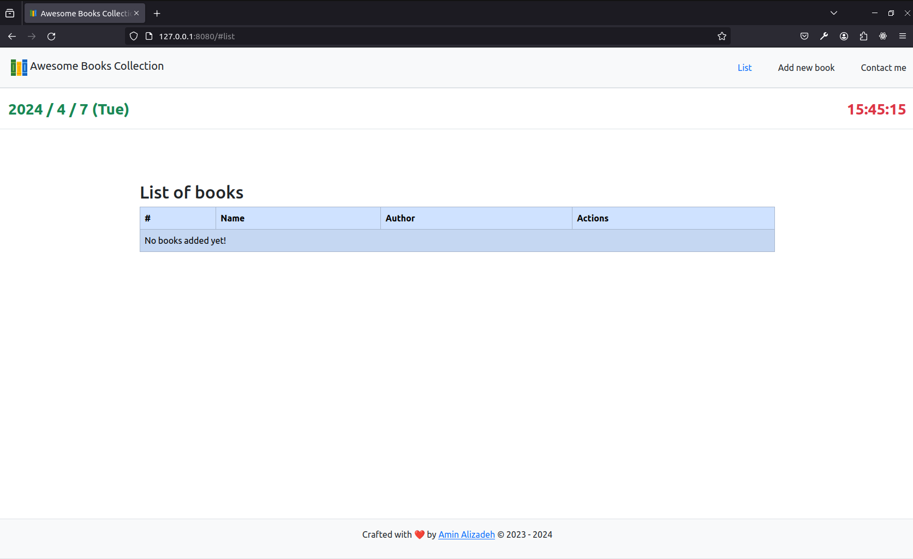
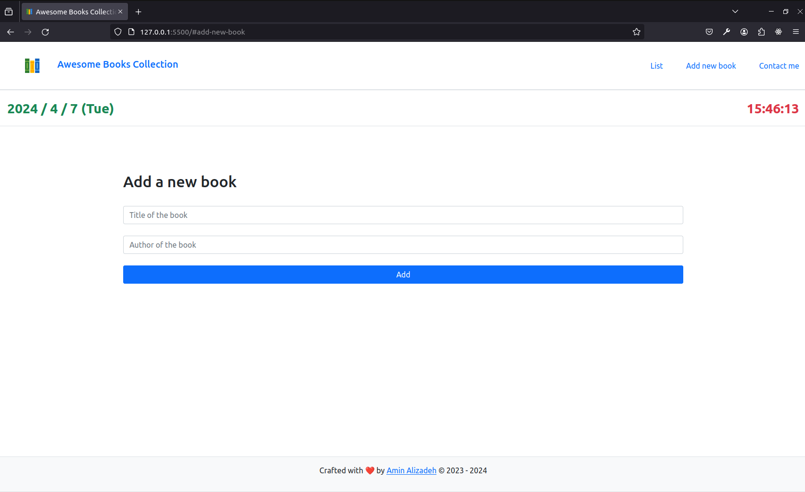
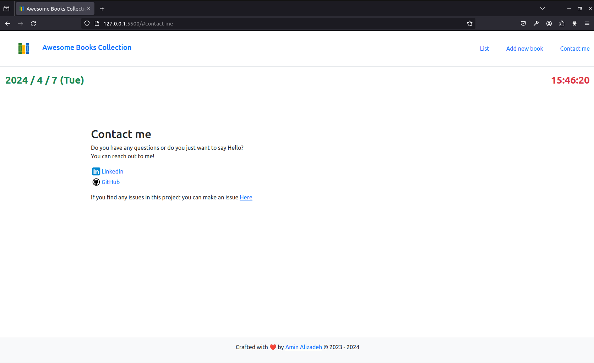
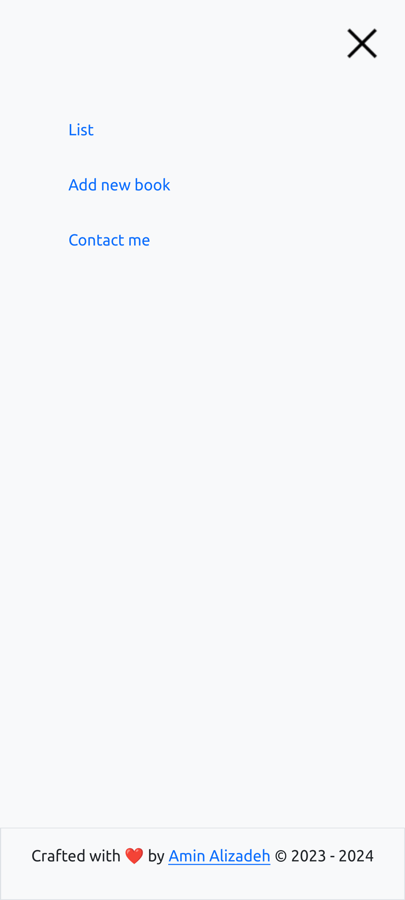
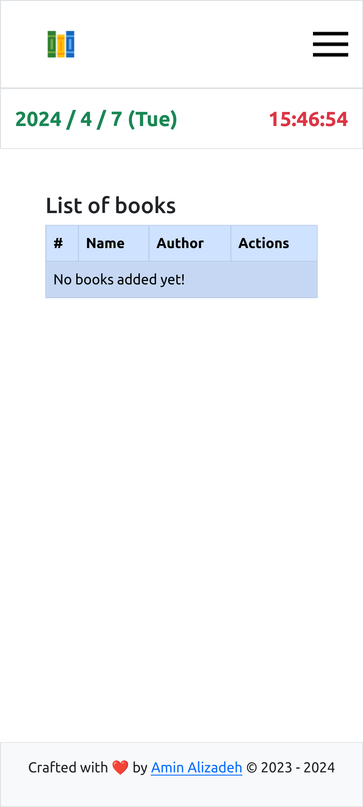
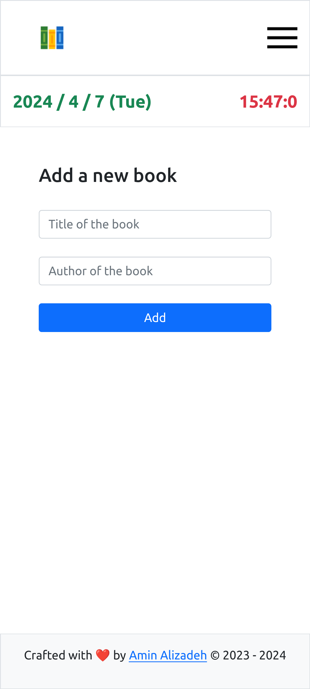
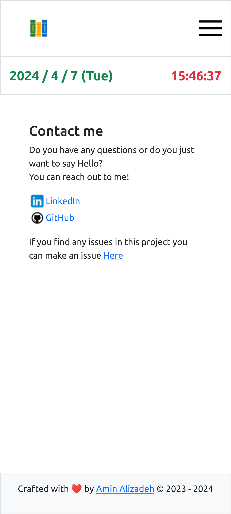

# 📗 Table of Contents

- [📗 Table of Contents](#table-of-contents)
- [📖 About the project](#about-project)
  - [🛠 Built With](#built-with)
    - [Tech Stack](#tech-stack)
    - [Key Features](#key-features)
  - [🚀 Live Demo](#live-demo)
  - [💻 Getting Started](#getting-started)
    - [Prerequisites](#prerequisites)
    - [Setup](#setup)
    - [Install](#install)
    - [Usage](#usage)
    - [Deployment](#deployment)
  - [👥 Authors](#authors)
  - [🔭 Future Features](#future-features)
  - [🤝 Contributing](#contributing)
  - [⭐️ Show your support](#️show-your-support)
  - [🙏 Acknowledgments](#acknowledgments)
  - [📝 License](#license)

<!-- PROJECT DESCRIPTION -->

## 📖 Awesome Books Collection <a name="about-project"></a>

Awesome Books Collection is a web app to store your favorite books. The user can
`Add/Read/Update/Delete` (all `CRUD` functionalities) to the collection.

This project was built with vanilla JavaScript with modules (`functional programming`) and a Class (`object-oriented programming`).

I tried to use both approaches to learn how to implement an idea into a digital solution using both of these principles.

For storing data I chose `local storage` the reason was to learn how to store data in it and how to manipulate data
using vanilla JavaScript.

> Desktop screenshots





> Mobile screenshots







## 🛠 Built With <a name="built-with"></a>

### Tech Stack <a name="tech-stack"></a>

<details>
  <summary>Client</summary>
  <ul>
    <li>
      <a href="https://developer.mozilla.org/en-US/docs/Web/JavaScript">
      Javascript (modules)
      </a>
    </li>
    <li>
      <a href="https://getbootstrap.com/">Bootstrap</a>
    </li>
    <li>
      <a href="https://developer.mozilla.org/en-US/docs/Web/CSS">CSS3</a>
    </li>
    <li>
      <a href="https://developer.mozilla.org/en-US/docs/Web/HTML">HTML5</a>
    </li>
  </ul>
</details>

<!-- Features -->

### Key Features <a name="key-features"></a>

- Fully responsive
- OOP
- Functional approach (using modules)
- Pretty UI and elegant UX as a side project!
- SPA (single page application)
- Routing system
- CRUD
- Display Date and Time
- Linters (Eslint, Sytlelint, Webhint, Lighthouse)
- GitHub Actions
- Well documented

<p align="right">(<a href="#readme-top">back to top</a>)</p>

<!-- LIVE DEMO -->

## 🚀 Live Demo <a name="live-demo"></a>

- [Live Demo Link](https://m-aminalizadeh.github.io/Awesome-books-collection/)

<p align="right">(<a href="#readme-top">back to top</a>)</p>

<!-- GETTING STARTED -->

## 💻 Getting Started <a name="getting-started"></a>

To get a local copy up and running, follow these steps.

### Prerequisites

To run this project you'll need:

- [Node js](https://nodejs.org/en)
- [Vscode](https://code.visualstudio.com/) or any other IDE

### Setup

Clone this repository to your desired folder:

```sh
  git clone git@github.com:M-AminAlizadeh/Awesome-books-collection.git awesome-books-collection
  cd awesome-books-collection
```

### Install

Install this project with:

```sh
  npm install
```

### Usage

To start/run the project:

```sh
  npm start
```

### Deployment

You can deploy this project using these:

- [GitHub Pages](https://pages.github.com/)
- [Vercel](https://vercel.com/)
- [Netlify](https://www.netlify.com/)

<p align="right">(<a href="#readme-top">back to top</a>)</p>

<!-- AUTHORS -->

## 👥 Authors <a name="authors"></a>

**Amin Alizadeh**

- [GitHub](https://github.com/M-AminAlizadeh)
- [LinkedIn](https://www.linkedin.com/in/m-amin-alizadeh/)

<p align="right">(<a href="#readme-top">back to top</a>)</p>

<!-- FUTURE FEATURES -->

## 🔭 Future Features <a name="future-features"></a>

- Dark/light Theme
- Add backend and DB instead of local storage

<p align="right">(<a href="#readme-top">back to top</a>)</p>

<!-- CONTRIBUTING -->

## 🤝 Contributing <a name="contributing"></a>

Contributions, issues, and feature requests are welcome!

Feel free to check the [issues page](https://github.com/M-AminAlizadeh/Awesome-books-collection/issues).

<p align="right">(<a href="#readme-top">back to top</a>)</p>

<!-- SUPPORT -->

## ⭐️ Show your support <a name="support"></a>

If you like this project kindly give it a ⭐

<p align="right">(<a href="#readme-top">back to top</a>)</p>

<!-- ACKNOWLEDGEMENTS -->

## 🙏 Acknowledgments <a name="acknowledgements"></a>

I would like to thank Microverse for the idea behind this and I only tried to implement it.

<p align="right">(<a href="#readme-top">back to top</a>)</p>

<!-- LICENSE -->

## 📝 License <a name="license"></a>

This project is under [MIT](./LICENSE) licensed.

<p align="right">(<a href="#readme-top">back to top</a>)</p>
